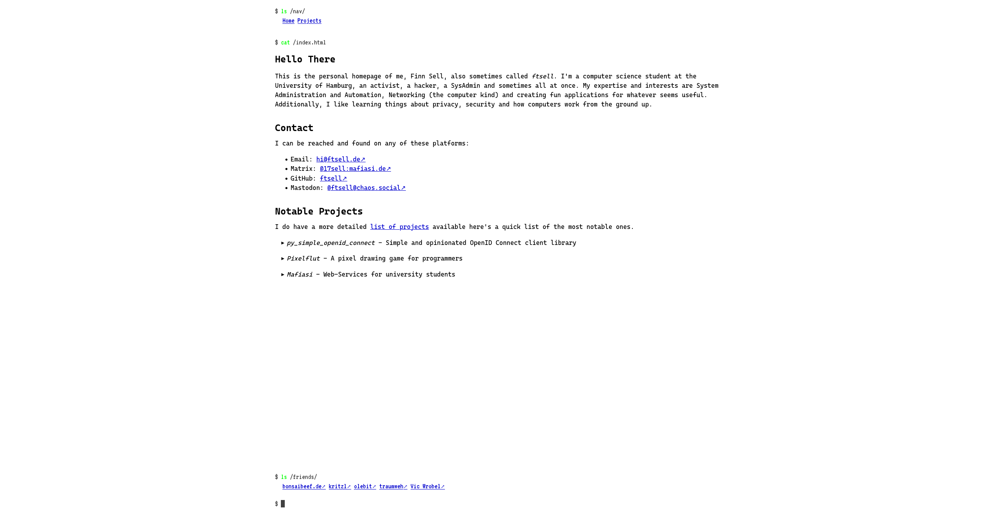
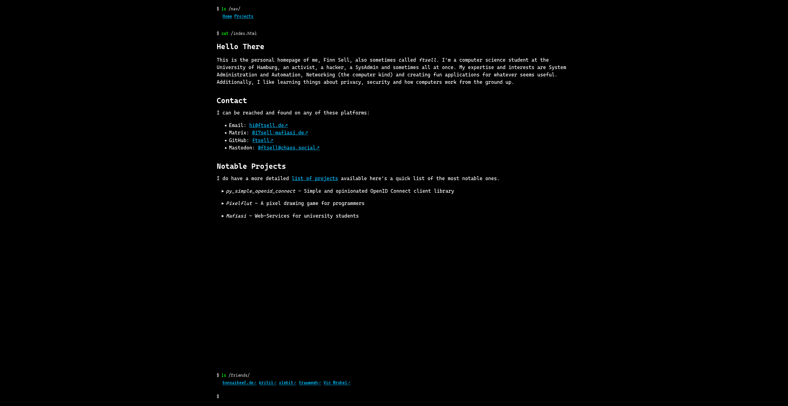

# Homepage

The source repository for my personal homepage at [https://ftsell.de](https://ftsell.de).
This homepage is my personal corner of the internet with which I like to play around and showcase my stuff.
It also includes a little blog on which I occasionally post stuff.

## Technical Details

The homepage has gone through **many** iterations, starting of at plain HTML + CSS, then going to Vue.js, Nuxt.js,
plain HTML again but this time with some fancy vite tooling around it and has by now evolved into
a [FastAPI](https://fastapi.tiangolo.com/) application.
The reason is that FastAPI gives me the power to implement exactly what I want while not being unnecessarily complex.

## Running It

The repository contains a Pipfile defining all python dependencies which can be used with *Pipenv* to create a
python virtual environment in which all dependencies are installed.
Afterward, the web server can be started by running `hypercorn --reload homepage.main:app` while being inside the `src/` directory
or having otherwise made it available in pythons import path.

Alternatively, a *Dockerfile* is provided which builds a docker image for the whole application
including static asset serving via nginx.

## Configuration

This website serves mostly static content and requires basically no configuration.
What little configuration is available is done via environment variables.

The following variables are available:

- `DEV_MODE` a boolean indicating whether debug mode is enabled.
  In this mode, caching is disabled.
